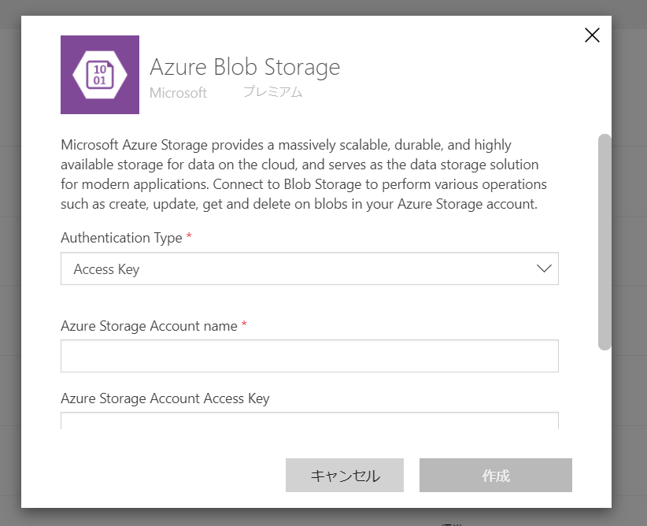
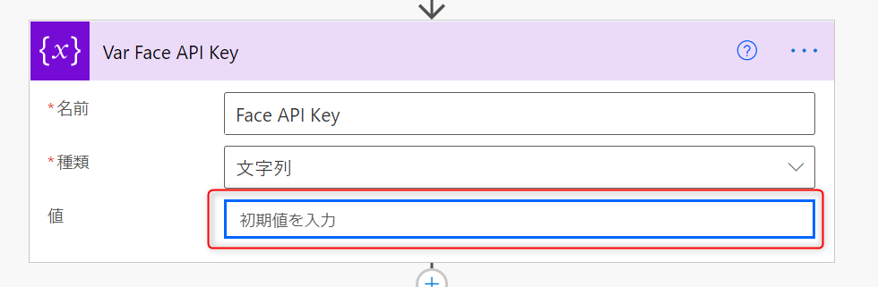
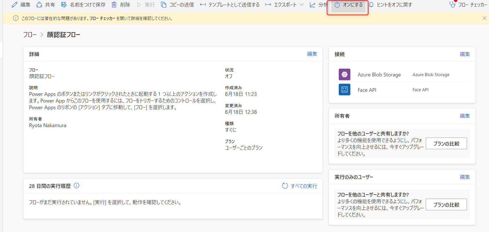
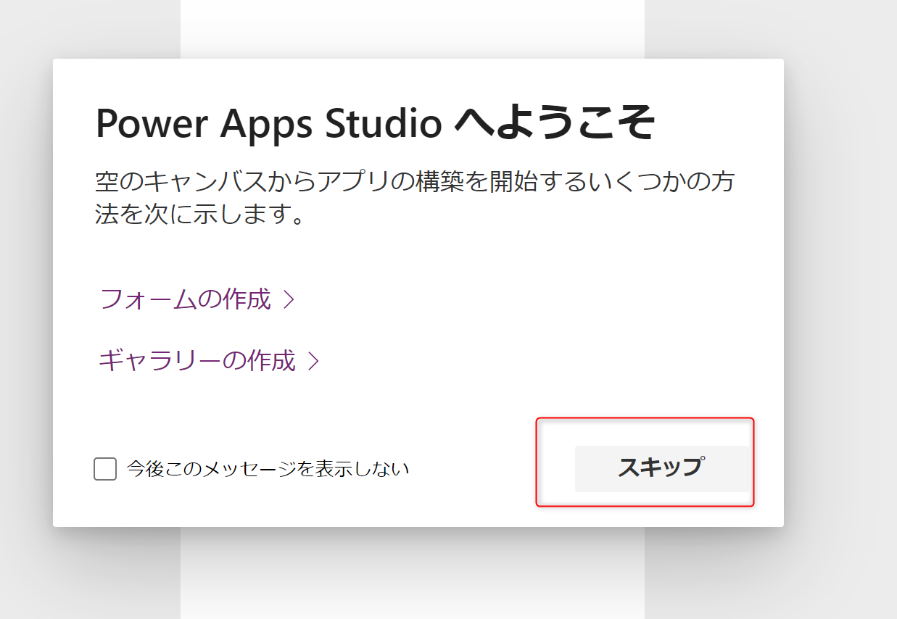
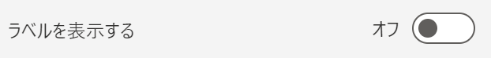
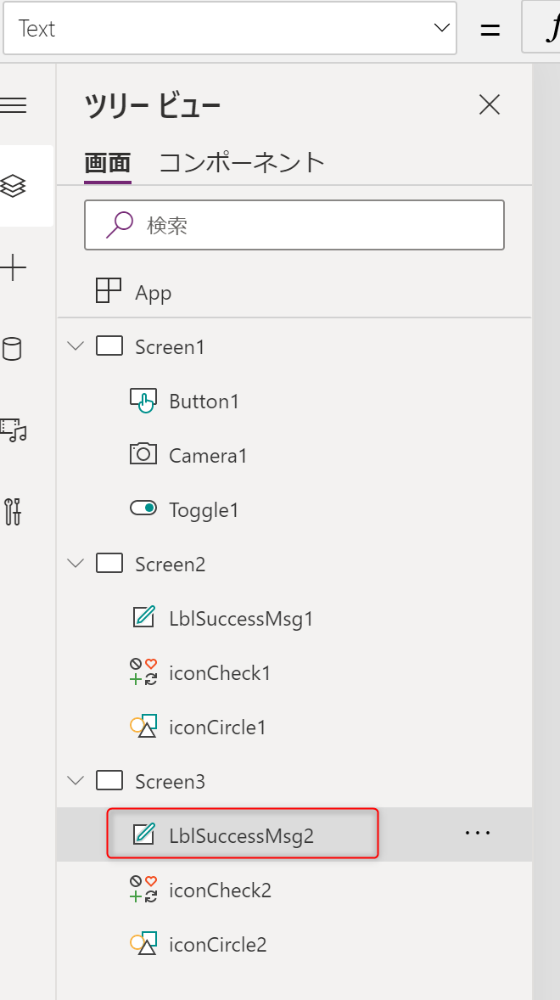

来訪受付アプリ作成手順
===

<!-- TOC -->

- [1. Power Automate Cloud Flow Import](#1-power-automate-cloud-flow-import)
- [2. インポートしたフローの編集](#2-インポートしたフローの編集)
- [3. 受付アプリ の作成](#3-受付アプリ-の作成)
    - [3.1. 認証画面の作成](#31-認証画面の作成)
    - [3.2. 成功画面の作成](#32-成功画面の作成)
    - [3.3. 失敗画面の作成](#33-失敗画面の作成)

<!-- /TOC -->

# 1. Power Automate Cloud Flow Import

1.  [こちらのフローインポートファイル](./PowerAutomate/顔認証フローインポートファイル.zip) をダウンロードします。

2. Power Automate にアクセスします。


3. 開発者環境になっていることを確認します。


4. マイフローをクリックします。


5. インポートをクリックします。


6. アップロードをクリックします。


7. ダウンロードしたインポートファイルを選択します。


8. アップロードが行われるので終わるまで待ちます。


9. 関連リソースの選択がありますので、「インポート自に選択する」をそれぞれクリックし、Face API とストレージアカウントの接続情報を指定します。


※ない場合は、新規作成より認証情報をそれぞれ作成します。


Azure Blob Storage



Face API


10. 接続情報の指定が完了するとインポートが押せるようになるので、インポートします。


11. インポートが完了するとこのような表示になります


# 2. インポートしたフローの編集

1. マイフローを開くと、「顔認証フロー」が追加されています。


2. 「顔認証フロー」にカーソルを合わせ、編集ボタンをクリックします。


3. 「Var Face API URL」をクリックし、値に作成したFace API のURLを入力します。


URL は Face API のエンドポイントで取得できます。


4. 「Var Face API Key」をクリックし、値に作成したFace APIのアクセスキーを入力します。



5. 「BLOB を作成する（V2）」をクリックし、ストレージアカウント名とフォルダーパスをそれぞれ作成したものを指定します。


6. 「Get a Person Group」をクリックし、Person Group Id を作成したIDに切り替えます。


7. 「保存」をクリックします。


8. 前のページに戻ります。


9. 「オンにする」をクリックします。




# 3. 受付アプリ の作成

1. Power Apps を開きます。


2. キャンバスアプリを一から作成をクリックします。


3. 任意の名称にして、形式は「電話」にし、「作成」をクリックします。


4. ポップアップ表示はスキップします。




## 3.1. 認証画面の作成

このような画面を作っていきます


①カメラ切り替え用のトグルスイッチ
②カメラの映像
③顔認証撮影ボタン


1. 「挿入」をクリックします。


2. 入力から「切り替え」をクリックします。


3. 右ペインのプロパティから「ラベルを表示する」をオフにします。




4. Toggle1 が選択されている状態で、左上のプロパティボックスから「OnChange」を選択します。


5. 関数バーに以下を入力します。

```
If(
    CameraID=0,
    UpdateContext({CameraID:1}),
    UpdateContext({CameraID:0})
)
```

6. 「挿入」＞「メディア」から「カメラ」をクリックします。


7. Camera1 が選択されている状態で、左上のプロパティボックスを「Camera」にセットし、関数バーに以下を入力します。


```
CameraID
```

8. 右ペインで「ストリームレート」を100に変更します。


9. 「挿入」から「ボタン」をクリックします。


10. Button1 が選択されている状態で「アクション」＞「Power Automate」をクリックします。


11. インポートしたフロー「顔認証フロー」を選択します。


12. Button1 が選択されている状態で、左上のプロパティボックスが「OnSelect」になっていることを確認し、関数バーを以下のように書き換えます。

```
Set(
    rtn,
    顔認証フロー.Run(Camera1.Stream)
);
If(
    rtn.rtn="Success",
    Navigate(Screen2),
    Navigate(Screen3)
)
```

## 3.2. 成功画面の作成

このような画面を作ります


1. 「挿入」から「新しい画面」をクリックします。


2. 「成功」をクリックします。


3. 「LblSccessMsg1」をクリックします。


4. 左上のプロパティボックスを「Text」にセットし、関数バーに以下を入力します。


```
Concatenate(
    rtn.visitorname,
    "様、いらっしゃいませ！",
    Char(10),
    "入室を許可します"
)
```

## 3.3. 失敗画面の作成

このような画面を作ります


1. 「挿入」から「新しい画面」をクリックします。


2. 「成功」をクリックします。


3. 「LblSccessMsg2」をクリックします。




4. 左上のプロパティボックスを「Text」にセットし、関数バーを以下のように書き換えます。


```
"顔認証に失敗しました"
```

5. 「iconCheck2」をクリックします。


6. 右ペインのアイコンを「キャンセル」に変更します。


7. 「iconCircle2」をクリックします。


8. 右ペインの色を赤色に変更します。


9. ファイルから保存します。


